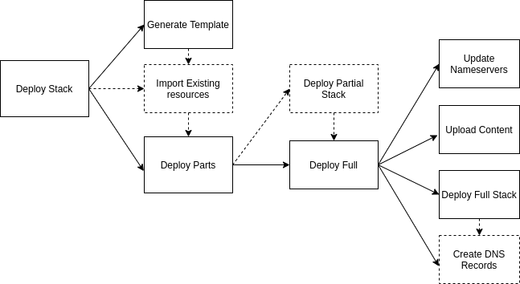

# Torus Stack
A promise-based javascript SDK that generates and deploys JSON cloudformation templates for static websites in AWS. It uses the AWS SDK to create, and execute changesets in a particular sequence that enables automation of the entire process while maintaining a short deployment time.

You are free to customize the generated cloudformation template or its resources individually in any way you want using the AWS console/CLIs/SDKs and/or the torus stack SDK/CLI command. You can also push the arjan_config to github and enable other team-members (with permission) to collaborate on the stack. Arjan facilitates this process by creating a per-stack IAM policy that can easily be assigned to other users in AWS.

## Features
- Creates a single cloudformation template
- Saves your cloudformation changesets locally
- Creates per-stack IAM roles
- Automatically imports existing resources for a given domain in AWS
- Adds continous deployment with github using codepipeline
- Completely open source
- Responsive community support 🙂
## Getting Started

**Prerequisites**

- An AWS account 
- node and npm
- The latest version of the Arjan CLI

**Deploy a static site with a CDN and HTTPS** 

- pop up your terminal, go into your desired project `cd project_name`, and run `arjan stack create prod`

- **When using Arjan Tools you are using your own AWS account from your own machine.**
- **Any charges incurred by your websites will be billed directly from AWS to your AWS account.**
- **Arjan Tools does NOT have any access to your AWS account/bill.**

# Architecture

Because the content in a static site doesnt have to be processed on a request basis it can be served completely from a server’s cache, or a cheaper cloud based object storage solution like AWS s3. To place the content closer to the end users, provide faster response times, and a secure url, a CDN (content distribution network) can be added.

# setups

For an easier development workflow we have defined some setups that include Dev, Test and Prod (production). You can customize these by additionally providing flags.

**dev → test → prod**

1. **Dev:** public S3 bucket
2. **Test:** public S3 root bucket, www reroute bucket and a route53 hosted zone.
3. **Prod:** public S3 root bucket, www reroute bucket, route53 hosted zone, cloudfront distribution, ACM certificate
# How it Works

The Torus Stack SDK has a series of methods that take care of generating/provisioning templates as well as uploading content and executing DNS operations. The main deploysatck method generate a partial template and  a full template for your stack. The partial template contains all the desired resources excluding the CDN, ACM certificate and DNS records. Then it checks if there are any existing resources, if true it will import those exisitng resources then it will execute the deploy parts method. The deploy parts method deploys the partial stack and then calls the deploy full method. the deployFull method synchronosuly updates the nameservers, uploads content, and deploys the full stack (cdn and ACM certificate) then creates DNS records.

1. Setting up
2. Generating templates
3. if(existing reosurces) import existing resources
4. if(template doesnt include all basic resources) deploying partial stack
5. if(domain != dns) updating nameservers
6. if(content) uploading content
7. if(full template != existing template) deploying the full stack
8. if(dns != AWS) creating DNS recrods
# Cost breakdown (from AWS)

This is a breakdown of the costs of hosting a static site in AWS
Let’s say your website uses CloudFront for a month (30 days), and the site has 1,000 visitors each day for that month. Each visitor clicked 1 page that returned a single object (1 request) and they did this once each day for 30 days. Turns out each request is 1MB for the amount of data transferred, so in total for the month that comes to 30,000MB or 29GB (1GB = 1,024MB). Half the requests are from the US and half are from Europe, so your monthly total for data transferred comes to $2.47. Also, each click is an HTTP request, so for the month that equals 30,000 HTTP requests, which comes to a total of $0.02 for the month. Adding the two values together, the total cost for using CloudFront for this example would be $2.49 for the month.

| **Resource**   | **Consumption**      | **Cost**   |
| -------------- | -------------------- | ---------- |
| Cloudfront     | 29GB bandwith        | $ 2.47     |
| Cloudfront     | 30,000 http requests | $ 0.02     |
| Route53        | 1 Hosted Zone        | $ 0.50     |
| s3             | 5GB storage          | $ 0.15     |
| **Total Cost** | ------------------   | **$ 3.14** |

# Programmatic Usage
    const {deployStack} = require('../lib/deployStack')
    
    deployStack('testingsit.com', {bucket:true}, {index:'index.html', error:'error.html', providers:{bucket:'aws'}}, true)

# API
